# Welcome to Docker

This is a repo for new users getting started with Docker.

You can try it out using the following command.
```
docker run -d -p 8088:80 --name welcome-to-docker docker/welcome-to-docker
```
And open `http://localhost:8088` in your browser.

# Building

Maintainers should see [MAINTAINERS.md](MAINTAINERS.md).

Build and run:
```
docker build -t welcome-to-docker . 
docker run -d -p 8088:3000 --name welcome-to-docker welcome-to-docker
```
Open `http://localhost:8088` in your browser.

# Welcome to Docker
Ce repos a pour but de voir les commandes de docker 

# Liste des commandes :

### Pour vérifier la version d'installation de docker avec la commande :

```
wsl --update
```


---------------------------------------------------------------------------------------------

### Pour afficher des informations détaillées sur l'installation Docker :

```
docker info
```
<p align="center">
  
  
  
</p>

---------------------------------------------------------------------------------------------

### Pour afficher la liste des conteneurs Docker en cours d'exécution :

```
docker ps
```
Resultat :


---------------------------------------------------------------------------------------------

### Pour afficher la liste de toutes les images Docker présentes sur le système local :

```
docker images
```
Resultat :
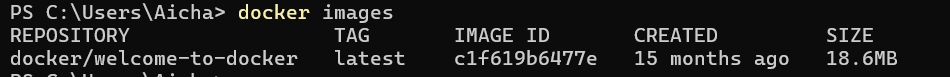

---------------------------------------------------------------------------------------------

### Pour lancer un conteneur Docker à partir d'une image:

```
docker run
```
Resultat :
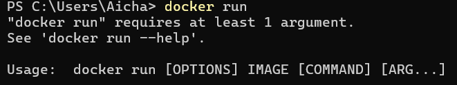

Pour corrigé l'erreur il faut rajouté le nom d'un container apres le run exemple : 

```
docker run [nom du container]
```
Resultat :
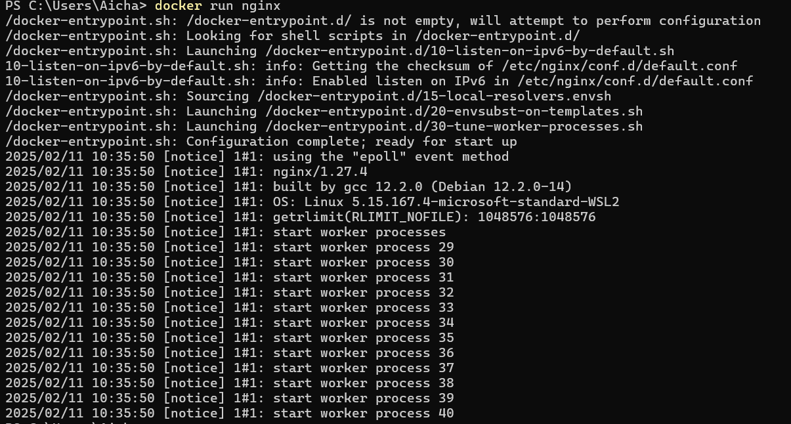

### Bonus :

On peut mettre un nom personalisé pour nos container et ça rends plus simple de les gerés


---------------------------------------------------------------------------------------------

### Pour arreter un ou plusieurs conteneurs :

```
docker stop
```
Resultat :
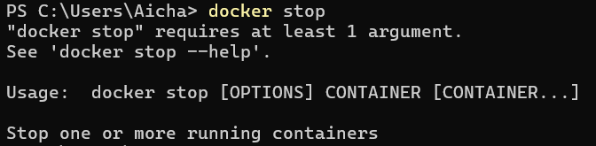

Pour corrigé l'erreur il faut rajouté le nom d'un container apres le stop exemple : 

```
docker stop [nom du container]
```
Resultat :
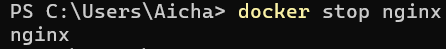


---------------------------------------------------------------------------------------------

### Pour télécharger des images Docker depuis dockerhub :

```
docker pull
```
Resultat :
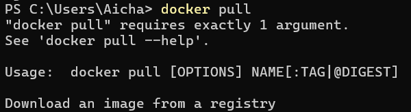

Pour corrigé l'erreur il faut rajouté le nom d'un container apres le pull exemple : 

```
docker pull [nom de l'image]
```
Resultat :
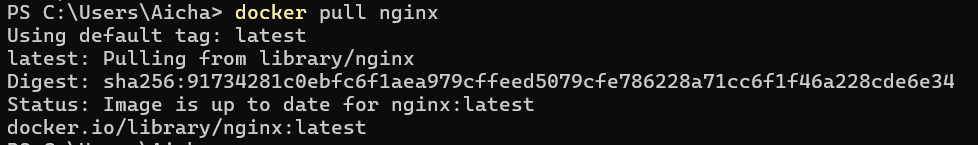

### Bonus :

On peut aussi choisir la version qu'on veut :
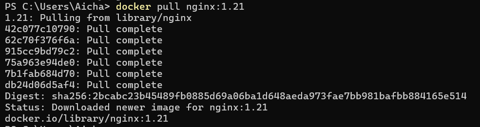


---------------------------------------------------------------------------------------------

### Pour voir la liste des images :

```
docker images
```
Resultat :
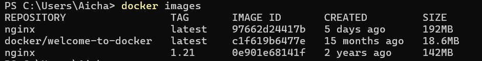

---------------------------------------------------------------------------------------------

### Pour construire le container Docker:

```
docker run -it --rm -p 8080:80 “nom de l’image”
```
Resultat :
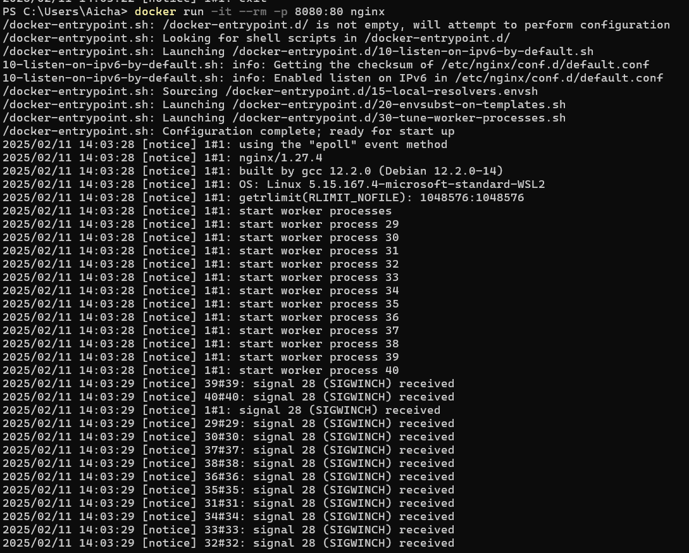
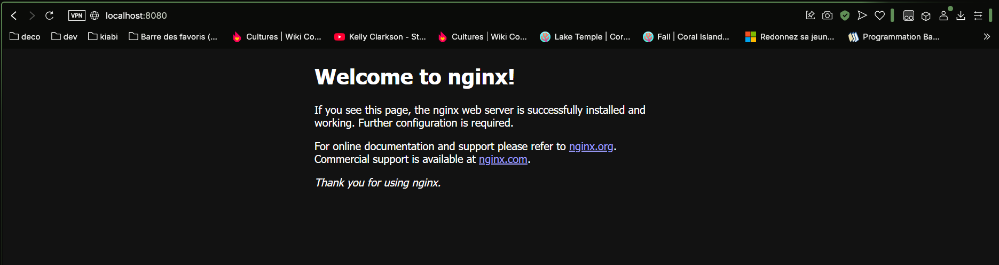

par contre si on fait que cette commande on pourras pas ecrire de commande apres celle ci . Il faut rajouté l'option ' -d ' pour le lancer et pouvoir faire des commandes apres.


```
docker run -it --rm -d -p 8080:80 nginx

```
Resultat :
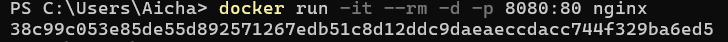

---------------------------------------------------------------------------------------------

### Pour stopper le container :

```
docker stop [id / nom du container]
```
Resultat :
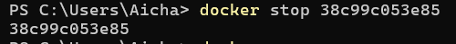

---------------------------------------------------------------------------------------------

### Pour supprimer le container :

```
docker rm [id / nom du container]
```
Resultat :
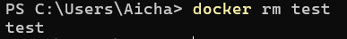

---------------------------------------------------------------------------------------------

### Pour supprimer une image :

```
docker rmi [id / nom de l'image]
```
Resultat :
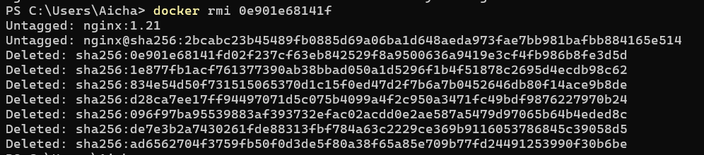

---
# Exemple de commande suppresion 

### Un conteneur spécifique :

```
docker rm [id / nom du container]
```

### Plusieurs conteneurs :

```
docker rm container1 container2 
```

### Tous les conteneurs arrêtés :

```
docker container prune

```

### Forcer la suppression d'un conteneur actif :

```
docker container prune -f

```
### Une image spécifique :

```
docker rmi [id/nom de l'image]

```
### Plusieurs images:

```
docker rmi image1 image2

```
### Toutes les images inutilisées:

```
docker image prune

```
### Toutes les images non utilisées:

```
docker container prune -a

```
### Forcer la suppression d'une image:

```
docker rmi -f [id/nom de l'image]

```