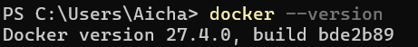
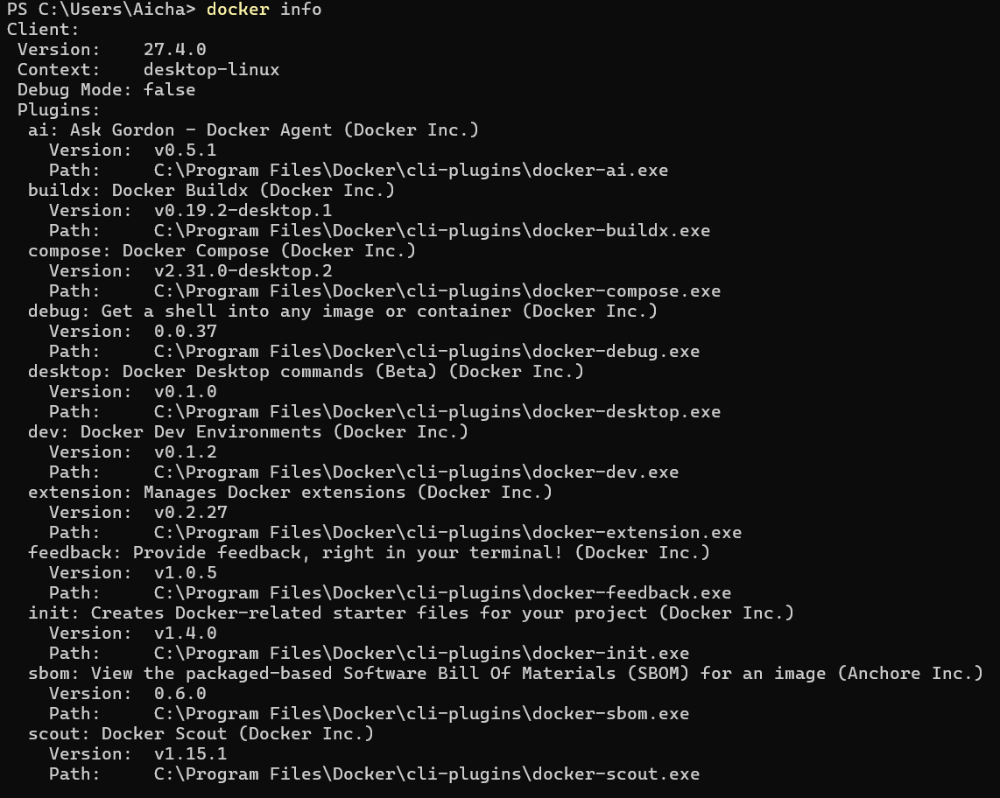
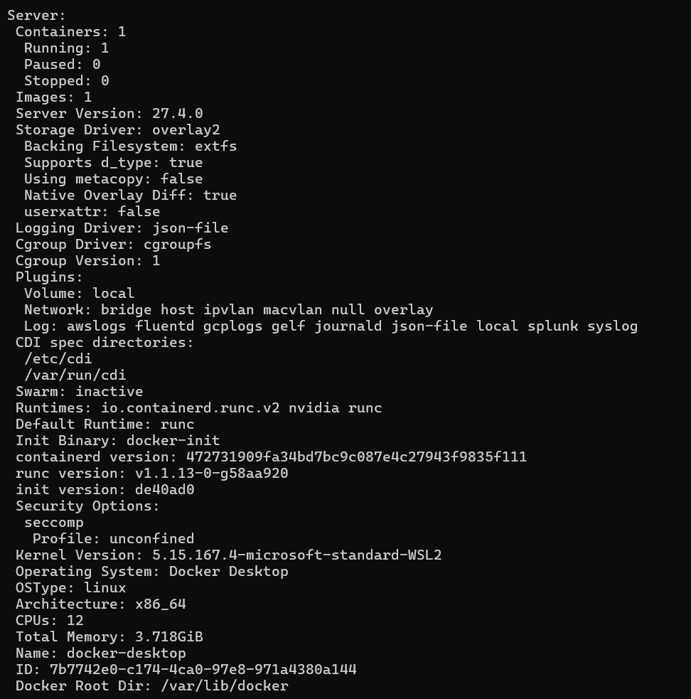
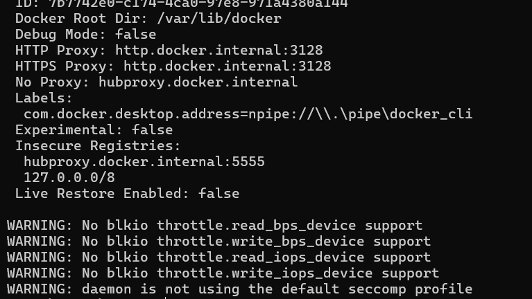
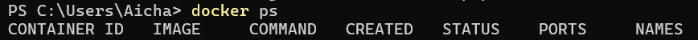

# Welcome to Docker

This is a repo for new users getting started with Docker.

You can try it out using the following command.
```
docker run -d -p 8088:80 --name welcome-to-docker docker/welcome-to-docker
```
And open `http://localhost:8088` in your browser.

# Building

Maintainers should see [MAINTAINERS.md](MAINTAINERS.md).

Build and run:
```
docker build -t welcome-to-docker . 
docker run -d -p 8088:3000 --name welcome-to-docker welcome-to-docker
```
Open `http://localhost:8088` in your browser.

# Welcome to Docker
Ce repos a pour but de voir les commandes de docker 

# Liste des commandes :

Pour vérifier la version d'installation de docker avec la commande :

```
wsl --update
```




Pour afficher des informations détaillées sur l'installation Docker :

```
docker info
```
<p align="center">
  
  
  
</p>


Pour afficher la liste des conteneurs Docker en cours d'exécution :

```
docker ps
```
Resultat :

