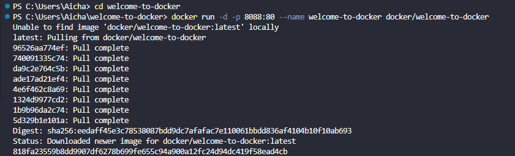
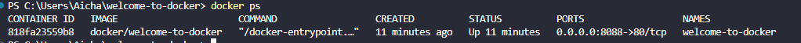
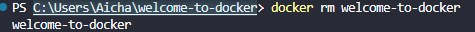
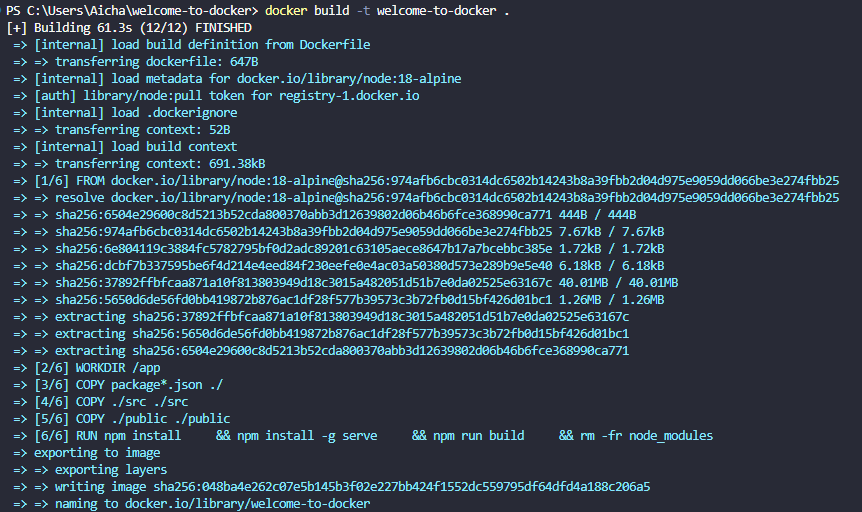
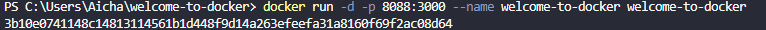
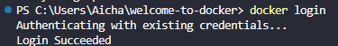
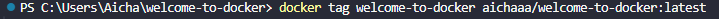
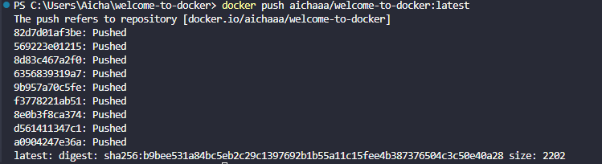

# Welcome to Docker - Part 2


## Le fonctionne d'une image deja créer

Je vais, depuis le terminal, me rendre dans le dossier où se trouve le projet, puis je lance la commande suivante
```
docker run -d -p 8088:80 --name welcome-to-docker docker/welcome-to-docker
```


Je vérifie que le conteneur est bien installé et allumé avec la commande suivante ::
```
docker ps
```


On remarque qu'il s'affiche dans le menu et que son statut est up. Maintenant, depuis l'URL, je vais entrer ceci : `http://localhost:8088`, et cela fonctionne.


 ## Creation d'une image

Pour pouvoir effectuer des modifications sur cette page, il faudra supprimer et recréer le conteneur. Pour cela :
 
1. Il faut supprimer le conteneur avec la commande suivante :
     ```
    docker rm welcome-to-docker
    ```


2. Ensuite, nous allons recréer l'image avec la commande suivante :
    ```
    docker build -t welcome-to-docker .
    ```


3. Puis, nous relançons le conteneur avec la commande suivante: 
    ```
    docker run -d -p 8088:3000 --name welcome-to-docker welcome-to-docker
    ```


Et on remarque que lorsqu'on retourne sur le site, le titre a bien changé.


 ## Publication de notre image

Pour partager notre projet, il faudra:

1. Se connecter depuis le terminal.
    ```
    docker login
    ```
    

2. Rajouter un tag à notre image en y ajoutant notre pseudo.
    ```
    docker tag welcome-to-docker aichaaa/welcome-to-docker:latest
    ```
    

3. Ensuite, envoie tout avec un push
    ```
    docker push aichaaa/welcome-to-docker:latest
    ```
    

    

 ## Publication de notre image