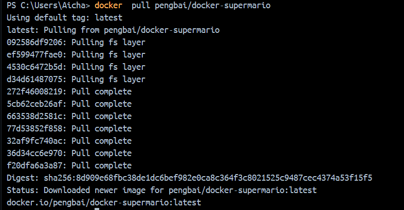
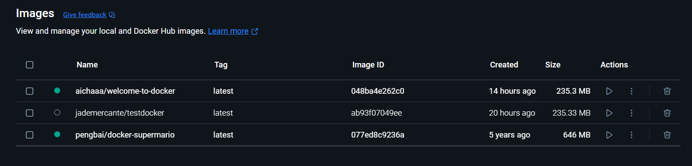
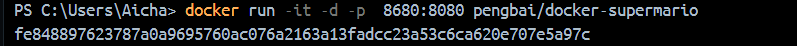
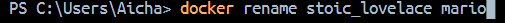
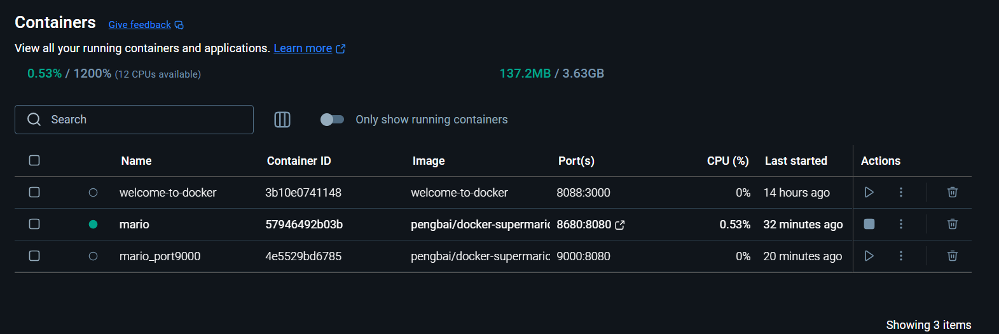
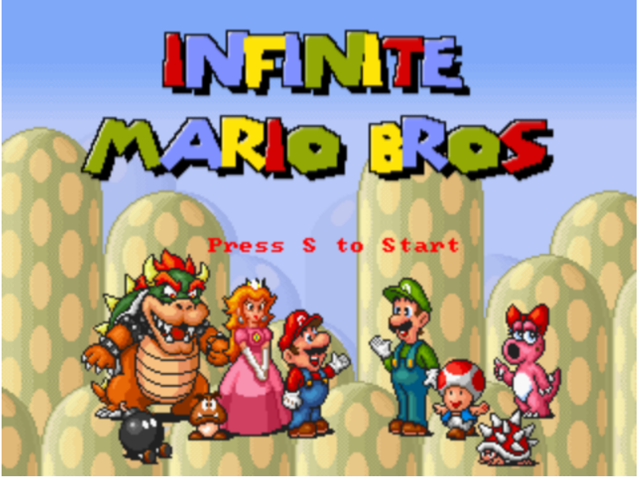
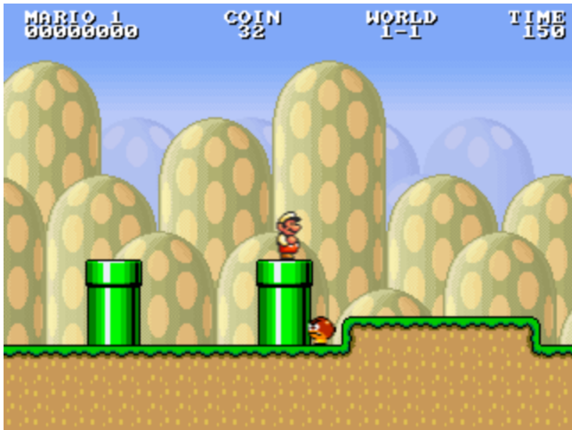
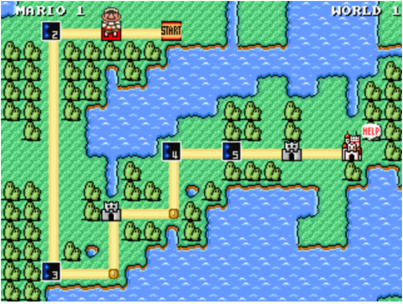

# Welcome to Docker - Part 3

# Tourner un emulateur 

On va testé un emulateur qui tourne un jeu Mario de l'utilisateur pengbai, pour cela depuis le docker desktop j'ouvre le terminal et je vais pull le projet dans la version la plus recente

``` 
docker pull pengbai/docker-supermario
```
  
  
 
On observe qu'il est present dans l'onglet des images mais il se passe rien dans le container du coup depuis le terminal je vais lancer un container avec cette image. Il ya deux methode avec docker compose (avec le fichier yaml) ou sinon les commande, personnellement j'ai utilisé la commande:

```
docker run -it -d -p  8680:8080 pengbai/docker-supermario
```


Comme jai oublié de mettre un nom personalisé je l'ai rename pour plus facilement le geré:
```
docker rename [ancien-nom] [nouveau-nom]
```


Apres tout ça on observe que le container est bien present dans l'onglet container avec le nom mario, j'ai aussi créer un nouveau container avec un nouveau port




Apres l'avoir eteint le deuxieme container je vais dans mon navigateur et je rentre `localhost:8680` et j'arrive bien devant le jeu

<p align="center">
  
  
  
</p>
