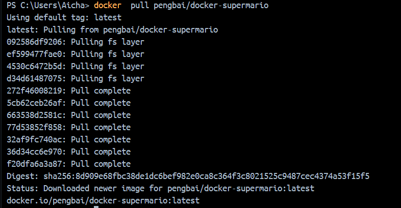
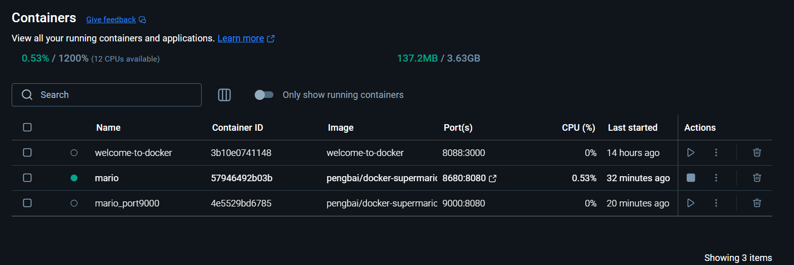
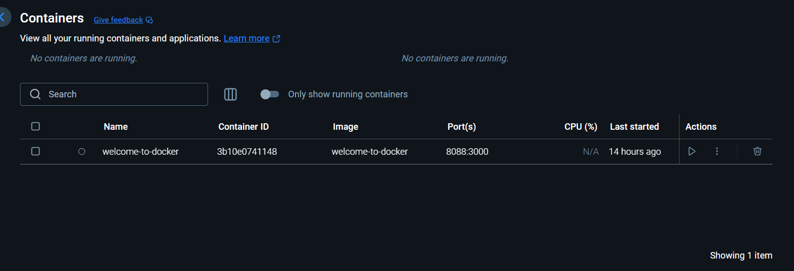
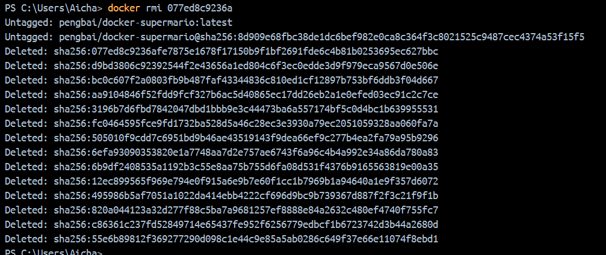

# Welcome to Docker - Part 3

# Tourner un emulateur 

"On va tester un émulateur qui exécute un jeu Mario créé par l'utilisateur pengbai. Pour cela, depuis Docker Desktop, j'ouvre le terminal et je vais récupérer la version la plus récente du projet avec `docker pull`

``` 
docker pull pengbai/docker-supermario
```
  
  
 
On observe que l'image est bien présente dans l'onglet Images, mais rien ne se passe dans l'onglet Containers. Je vais donc lancer un conteneur à partir de cette image via le terminal.
Il existe deux méthodes pour cela : soit avec Docker Compose (en utilisant un fichier YAML), soit en ligne de commande. Personnellement, j'ai utilisé la commande suivante :

```
docker run -it -d -p  8680:8080 pengbai/docker-supermario
```


Comme j’ai oublié de lui donner un nom personnalisé, je l’ai renommé pour le gérer plus facilement.:
```
docker rename [ancien-nom] [nouveau-nom]
```


Après tout cela, on observe que le conteneur est bien présent dans l'onglet Containers sous le nom mario. J'ai également créé un nouveau conteneur en utilisant un port différent.




Après avoir éteint le deuxième conteneur, je vais dans mon navigateur et je rentre `localhost:8680`. Je tombe bien sur le jeu.

<p align="center">
  
  
  
</p>

Du coup, pour l'éteindre, je vais chercher son ID avec `docker ps` ou `docker ps -a`, puis j'utilise la commande suivante :
```
docker stop [id]
```
 

On remarque que la pastille n'est plus verte, donc le conteneur est éteint.
Maintenant, je vais supprimer les deux conteneurs et l'image, un avec l'ID et l'autre avec le nom :
  
  ### les 2 methodes pour les conteneurs:
  
  
  
  ### les 2 methodes pour les images:
  
  
