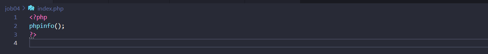
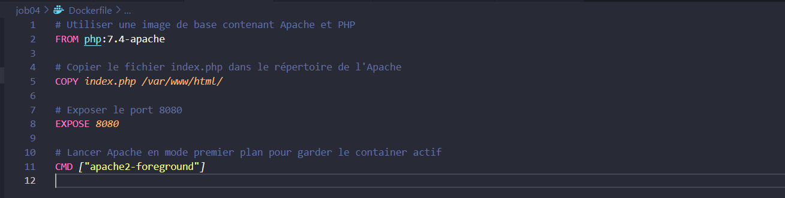
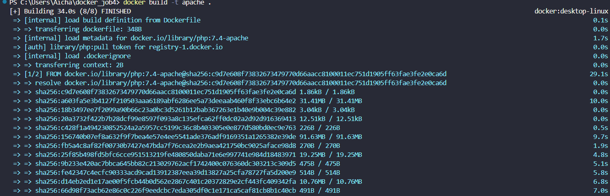
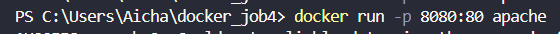
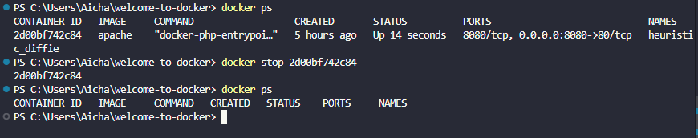

# Welcome-to-docker - JOB 04

On va créer notre premier Dockerfile pour générer un environnement Apache :

Pour cela, nous avons besoin d'un fichier index.php qui affichera les informations du serveur :


Ensuite, je vais créer mon fichier Dockerfile avec les configurations nécessaires.


## Creation de l'image et du container

Après, on doit construire l'image et lancer le container avec :

### l'image :
```
docker build -t apache . 
```

### le container:
```
docker run -d -p 8080:80 apache . 
```



Après son lancement, je peux accéder au site et voici ce que j'obtiens :


Du coup, pour l'arrêter, j'utilise cette commande :

