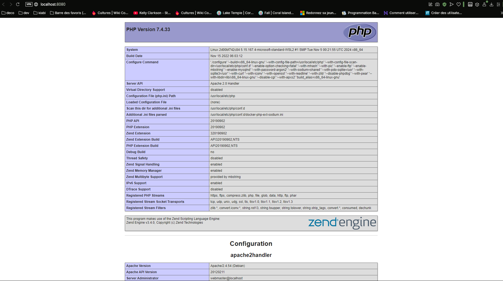

# Welcome-to-docker - JOB 04

On va créer notre premier dockerfile pour générer un environement apache:

Pour cela on a un besoin d'un fichier index.php qui nous affichera les infos du serveur :


Ensuite je vais créer mon fichier dockerfile avec les configurations


## Creation de l'image et du container

Apres on doit build l'image et le container avec :

### l'image :
```
docker build -t apache . 
```

### le container:
```
docker run -d -p 8080:80 apache . 
```


Apres qu'il soit lancer je peux acceder au site et je tombe sur ça :



Du coup pour l'arreter j'utilise cette commande :

