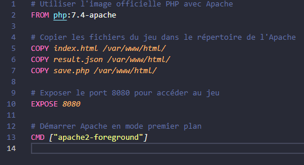
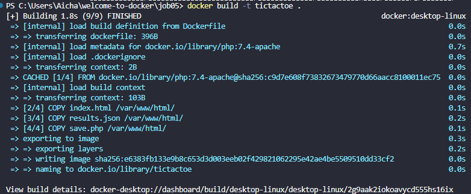
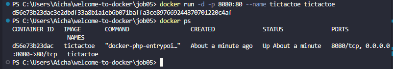

# Welcome-to-docker - JOB 05

On va apprendre a faire des volumes.

# Creation des premier fichiers
 
Apres avoir copier les fichier : index.html , result.json et save.php. Nous allons configuré notre dockerfile

Maintenant on peut creer notre image et notre container:

