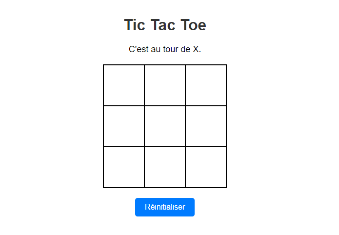
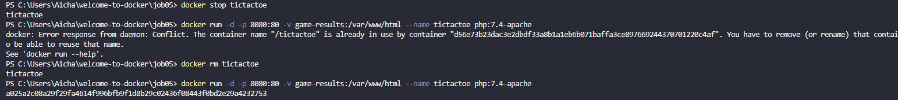
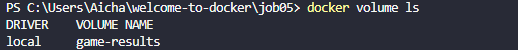
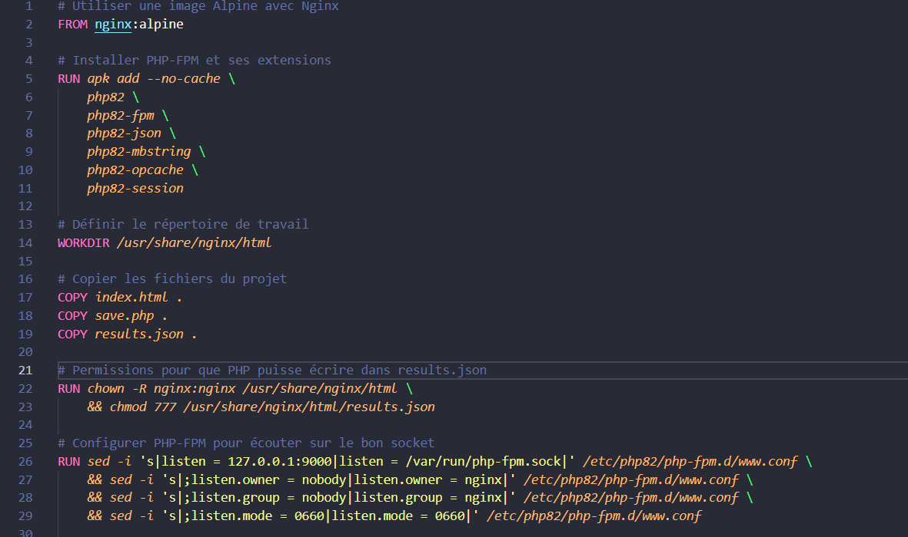
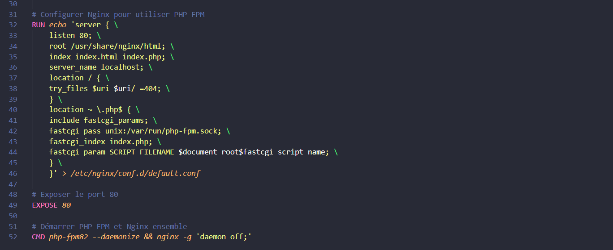
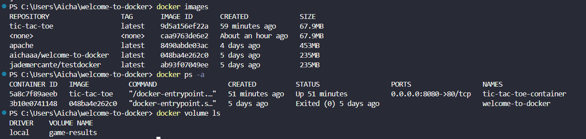
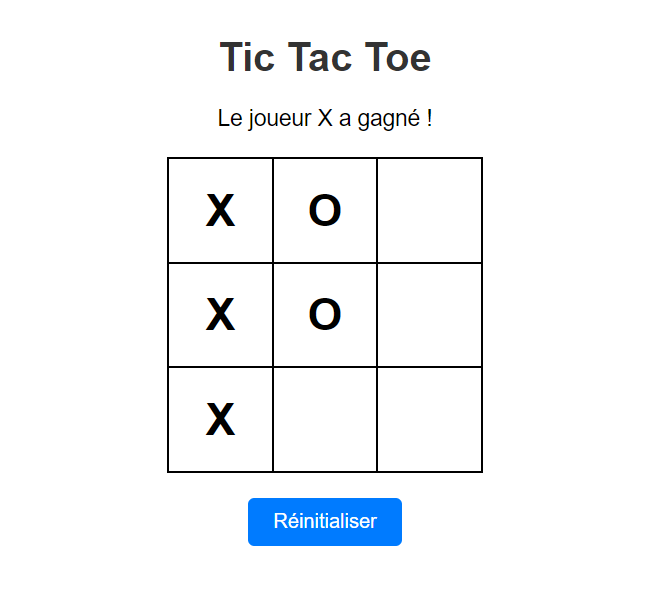
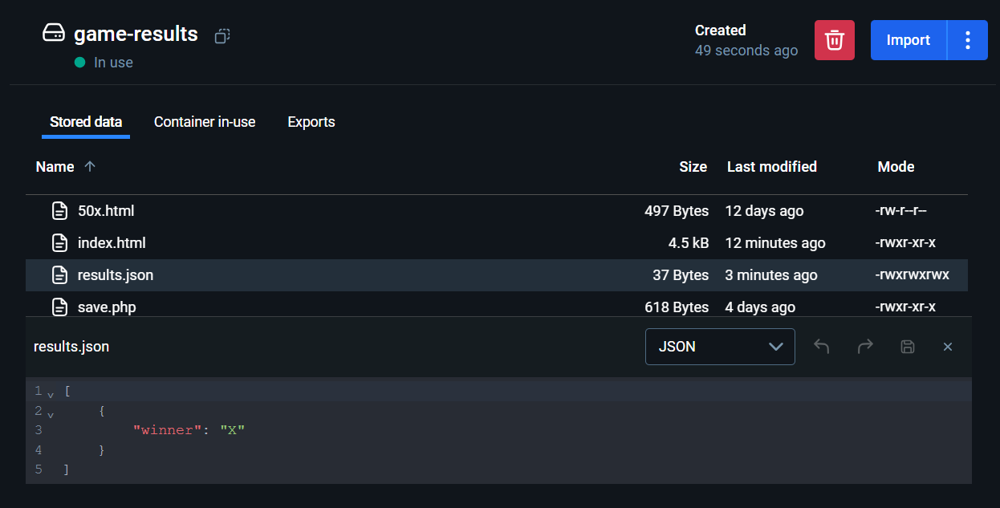
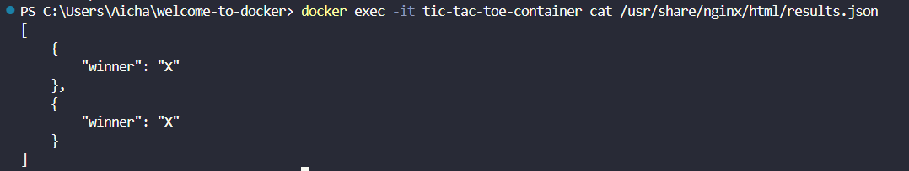
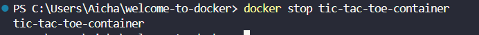

# Welcome-to-docker - JOB 05

On va apprendre à créer des volumes.

# Creation des premier fichiers
 
Apres avoir copier les fichiers : index.html , result.json et save.php. Nous allons configuré notre dockerfile.


Maintenant on peut creer notre image et notre container et lancer notre page:




# Creation du volume

On va maintenant créer notre volume “game-results” pour stocker les résultats dans un fichier results.json et le fichier save.php pour cela on va supprimé l'ancien container avec `docker rm tictactoe` en veillant d'avoir éteint le container puis on utilise cette commande qui creer et lance le volume pour un container precis : 
 
```
docker run -d -p 8080:80 -v game-results:/var/www/html --name tictactoe php:7.4-apache 
 ```
 

 Je peux regardé s'il est bien creer avec : 
 ```
 docker volume ls

 ```


# Le tic tac toe sous nginx

J'ai modifié tout le dockerfile car celui d'avant fonctionné avec apache 

<p align="center">
  
  
</p>


Ensuite jai fais les commandes suivante : 

```
docker built -t tic-tac-toe
docker volume create game-results
docker run -d -p 8080:80 -v game-results:/usr/share/nginx/html --name tic-tac-toe-container tic-tac-toe
```
Je verifie que tout est bien creer:



Ensuite j'ai testé le jeu et jai remarqué que les resultats s'affiche bien dans le volume , et j'ai verifié depuis le docker desktop et depuis le terminal avec:

```
docker exec -it tic-tac-toe-container cat /usr/share/nginx/html/results.json
```




Et pour stopper le container, il faut faire cette commande :


