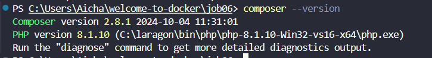
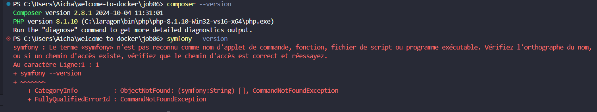
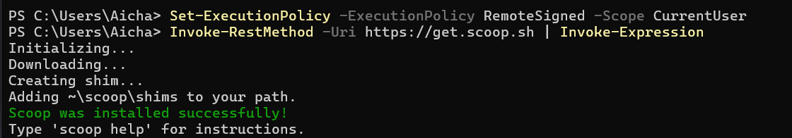
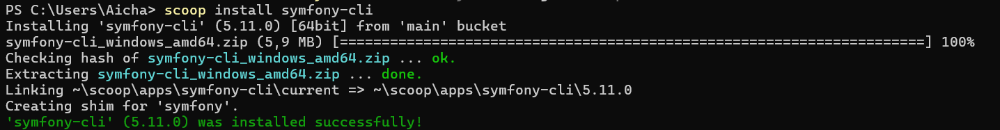
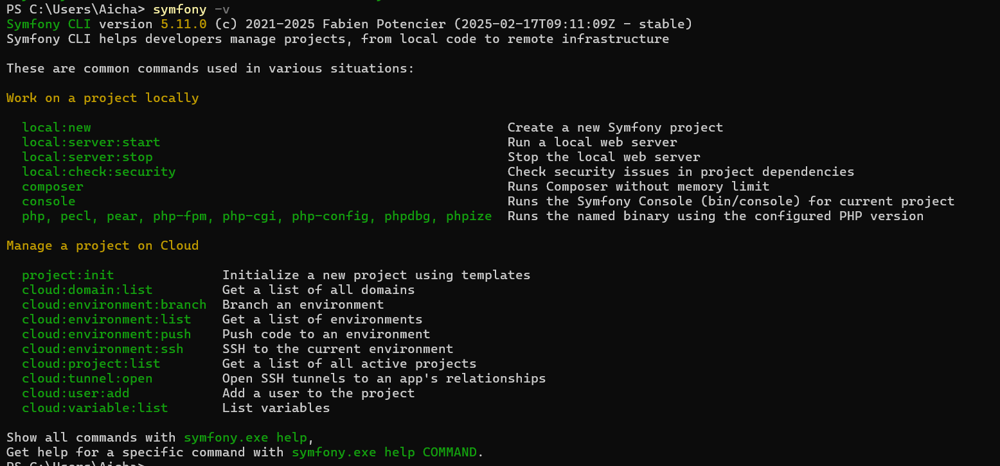
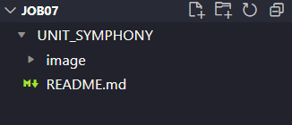
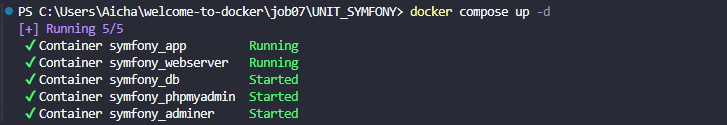

# Welcome-to-docker - Symphony
## ETAPE A :
### Étape 1 : Préparer l'environnement

Je vérifie si Docker et Docker Compose sont installés avec `docker --version` et `docker-compose version`. Comme il n'y a pas de message d'erreur, cela signifie qu'ils sont bien installés.

Je vérifie si `Composer` et `Symfony` sont installés avec `composer --version` et `symfony --version`. J'ai bien `Composer` installé, mais pas `Symfony`. Du coup, je vais installer `Scoop` pour utiliser une commande qui installe le `CLI Symfony`
1. Installation de scoop depuis le terminal de powershell :

2. Installation de CLI Symfony avec la commande scoop:

3. Vérification que Symfony est bien installé.

---
### Étape 2 : Créer un dossier de projet

Je vais créer un répertoire pour le projet Symfony et le nommer 'UNIT_SYMFONY', qui hébergera le README et les autres dossiers du projet.

  
---

### Étape 3 : Préparer le fichier Docker Compose

  

Voici notre fichier Docker compose :

  
  

Notre fichier `docker-compose.yml` liste tous les services dont nous avons besoin et les répertorie dans une variable appelée `services`. À l'intérieur, nous avons :

  

1. Le service `app` qui utilise l'image `php:8.2-fpm`, puis crée un conteneur nommé `symfony_app`. Il définit le répertoire de travail du conteneur à `/var/www/html`, et crée un volume à ce chemin `./app:/var/www/html`. Enfin, le service sera connecté à un réseau Docker nommé `symfony_network`."

2. Le service `webserver` utilise l'image `nginx:stable`, puis crée un conteneur nommé `symfony_webserver`. Il expose le port `8080` sur l'hôte pour le rediriger vers le port `80` du conteneur. Ensuite, il crée deux volumes : l'un pour lier le répertoire `./app de l'hôte` à `/var/www/html` dans le conteneur, et l'autre pour lier le répertoire `./nginx` de l'hôte à `/etc/nginx/conf.d` dans le conteneur. Le service dépend du service `app`, ce qui signifie qu'il sera lancé uniquement après que le service `app` soit démarré. Enfin, le service sera connecté à un réseau Docker nommé `symfony_network`.
 
3. Le service `database` utilise l'image `mysql:8.0`, puis crée un conteneur nommé `symfony_db`. Ensuite, il crée une base de données nommée `symfony`, définit l'hôte de la base de données comme `symfony_db`, et configure un utilisateur `symfony` avec le mot de passe `symfony`, ainsi qu'un mot de passe `root` pour l'utilisateur root. Il expose le port `3306` du conteneur vers le port `3306` de l'hôte pour permettre l'accès à la base de données depuis l'extérieur du conteneur. Ensuite, il crée un volume `db_data:/var/lib/mysql` qui sera utilisé pour stocker les bases de données et les relations internes de MySQL. Enfin, le service est connecté à un réseau Docker nommé `symfony_network`.

4. Le service `phpmyadmin` utilise l'image `phpmyadmin/phpmyadmin`, puis crée un conteneur nommé `symfony_phpmyadmin`. Il définit le redémarrage automatique avec restart: always, ce qui signifie que le conteneur sera redémarré si nécessaire. Il expose le port `8082` du conteneur vers le port `80` de l'hôte . Avec l'environment il configure phpMyAdmin pour se connecter à la base de données `symfony_db`. Il définit le mot de passe `root` de MySQL sur root, puis on spécifie la base de données `phpmyadmin` et on crée un utilisateur `symfony` avec le mot de passe `symfony` pour accéder à la gestion de phpMyAdmin. Le service dépend du service `database`, ce qui signifie qu'il sera lancé uniquement après que le service `database` soit démarré . Enfin, le service est connecté à un réseau Docker nommé `symfony_network`.

5. Le networks qui est pas un service définit un réseau Docker appelé `symfony_network`. Ce réseau utilise le driver `bridge`, qui permet aux conteneurs connectés à ce réseau de communiquer entre eux tout en étant isolés du reste du réseau extérieur

6. Le volumes qui est pas un service nommés declare 2 volumes. e premier, db_data, est utilisé pour stocker de manière persistante les données de la base de données. Le deuxième, phpmyadmin_data, est utilisé pour stocker les données spécifiques à phpMyAdmin, permettant ainsi de garder les informations même si les conteneurs sont redémarrés

 
Ensuite, je crée le dossier `nginx` avec un fichier `default.conf` Ce fichier il écoute les requêtes HTTP sur le port 80 et dirige les requêtes PHP vers un serveur PHP-FPM pour traitement. Il recherche par défaut les fichiers `index.php` ou `index.html` et gère les erreurs en redirigeant vers `index.php` si nécessaire. Il empêche également l'accès aux fichiers sensibles (comme `.htaccess`) pour des raisons de sécurité.

### Étape 4 : Installer Symfony

  

Normalement, il faut utiliser cette commande pour installer Symfony : `composer create-project symfony/website-skeleton app`. Selon la version de notre PHP, elle installera une version compatible. Du coup, étant donné que j'ai PHP 8.1, la commande m'installe Symfony 6.1. Cependant, nous voulions la dernière version, qui est la 7. Maintenant, il faut mettre à jour PHP, mais après plusieurs tentatives  ça ne fonctionne pas. Du coup, comme avec Docker, on était obligé d'installer `WSL`, et j'en ai profité pour installer le terminal Debian depuis le Microsoft Store.
  ___
### Étape 4.5 :  Debian

Après l'installation, je l'ai lancé et il me demande de rentrer un pseudo et un mot de passe.

> Je vous conseille de mettre un code pas très long, car certaines commandes demanderont ce code.

Ensuite, retournez sur VSCode, ouvrez un nouveau terminal avec la commande `wsl`, puis fermez ce terminal. Quand vous essayeriez de recréer un terminal, il y aura `Debian WSL` et on utilisera celui-là. Maintenant, on va exécuter plusieurs commandes :

> Vérifiez que vous êtes bien dans le dossier où se trouve le fichier `docker-compose.yml` avant de commencer.

 1. Mettre à jour les paquets :
 
    sudo apt update
    sudo apt upgrade 
    
2. Installer PHP et les extensions :

    sudo apt install php8.2 -y
    sudo apt install php-zip unzip
    sudo apt install php8.2-xml

3. Installation de Symfony avec Composer :

    composer create-project symfony/skeleton:"7.2.x" app

Maintenant, vous pouvez retourner dans votre terminal PowerShell sur VSCode et exécuter les commandes Docker pour vérifier que tout est bien installé 
    

> . A FAIRE 
 Trouver l’autre commande possible qui installe une autre forme de projet symfony , expliquez la dans le readme et la différence entre
> les deux
> . Comprenez et expliquez la différence entre les deux types d'installation de symfony (Installez un deuxième projet dans un autre
> dossier projet pour voir la différence) Montrez et expliquez la
> différence entre les deux installations.
> . Supprimez ce dernier projet et revenez au premier aussi bien dans docker que dans visual studio
___
### Étape 5 : Configurer la base de données sur le premier projet

Maintenant, modifions le fichier `.env` de Symfony dans le répertoire `app` pour connecter la base de données.

    
  
Pour utiliser cette commande `docker exec -it symfony_app bash`, il faut d'abord vérifier si le conteneur est bien en cours d'exécution avec `docker ps`. Si ce n'est pas le cas, on doit démarrer le conteneur avec `docker start symfony_app`. Cela nous donne :

  
___
### Étape 6 : Tester l'application

Depuis le navigateur, je vais sur l'URL `http://localhost:8080` et je tombe bien sur mon site.

  
