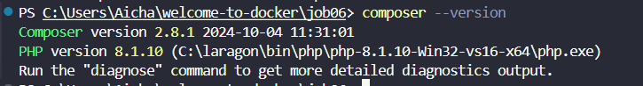
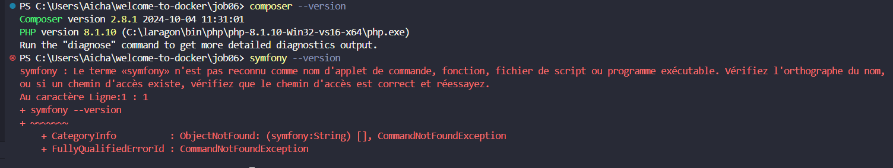
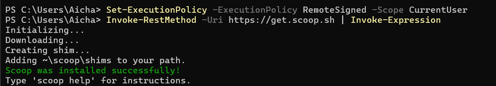
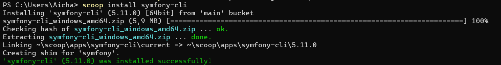
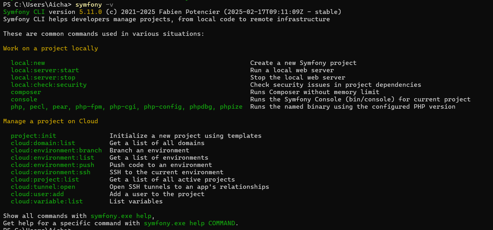

# Welcome-to-docker - Symphony  

## ETAPE A :

### Étape 1 : Préparer l'environnement

- Je verifie si docker et docker compose sont installer avec `docker --version` et `docker-compose version`. Comme il y'a pas de message d'erreur ça veut dire qu'ils sont bien installer.

- Je verifie si composer et symphony sont installer avec `composer --version` et ` symfony --version`. J'ai bien composer installer mais pas symphony du coup je vais installé `scoop` pour utilisé une commande qui installe symphony:

    1. J'installe scoop depuis le terminal de powershell :
    

    2. J'installe symphony avec la commande scoop: 
    

    3. Je verifie que symphony est bien installer
    

---

### Étape 2 : Créer un dossier de projet

- Je vais creer un répertoire pour le projet Symfony et je le nomme
“UNIT_SYMFONY” qui hébergera le readme et les autres dossiers du projet pour cela je vais le faire avec composer `composer create-project symfony/skeleton:"7.2.x" UNIT_SYMFONY` :

